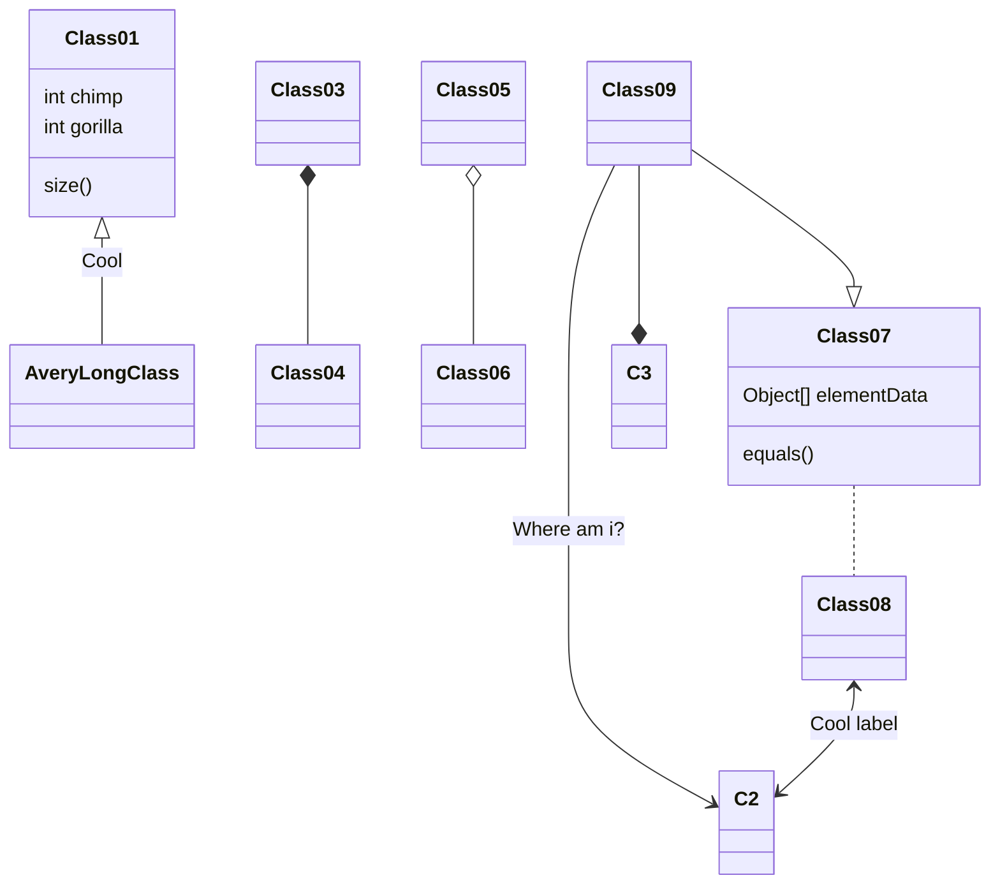

# Read only

```javascript
const list = [1, 2, 3, 4];

list.forEach(e => console.log(e))

list.map(e => 'Element: ' + e).forEach(e => console.log(e))
```

# Runnable

```javascript runner
const list = [1, 2, 3, 4];

list.forEach(e => console.log(e))

list.map(e => 'Element: ' + e).forEach(e => console.log(e))
```

# Sandbox

```javascript sandbox
const list = [1, 2, 3, 4];

list.forEach(e => console.log(e))

list.map(e => 'Element: ' + e).forEach(e => console.log(e))
```
 
# Mermaid

